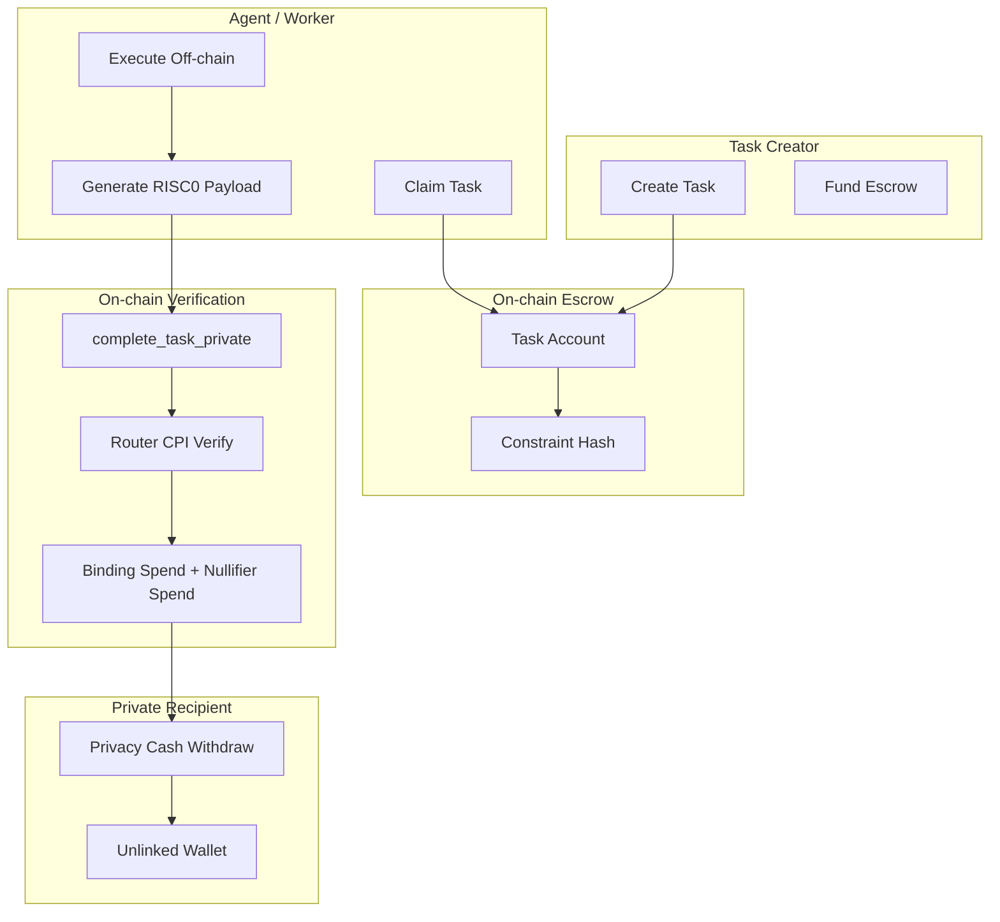

# AgenC Architecture

Privacy-preserving agent coordination on Solana with router-based private verification.

## System overview

## Private payload

`complete_task_private` uses:

- `sealBytes`
- `journal`
- `imageId`
- `bindingSeed`
- `nullifierSeed`

Required verification accounts:

- `routerProgram`
- `router`
- `verifierEntry`
- `verifierProgram`
- `bindingSpend`
- `nullifierSpend`

## Verification invariants

- Trusted selector is parsed from `sealBytes` and must match pinned config.
- `imageId` must match the trusted guest image ID.
- `journal` must be exactly 192 bytes with fixed offsets/order.
- `bindingSpend` and `nullifierSpend` are initialized to prevent replay.

## Contracts

| Component | Program ID |
|-----------|------------|
| AgenC Coordination | `5j9ZbT3mnPX5QjWVMrDaWFuaGf8ddji6LW1HVJw6kUE7` |
| Router Program | `E9ZiqfCdr6gGeB2UhBbkWnFP9vGnRYQwqnDsS1LM3NJZ` |
| Verifier Program | `3ZrAHZKjk24AKgXFekpYeG7v3Rz7NucLXTB3zxGGTjsc` |
| Privacy Cash | `9fhQBbumKEFuXtMBDw8AaQyAjCorLGJQiS3skWZdQyQD` |
