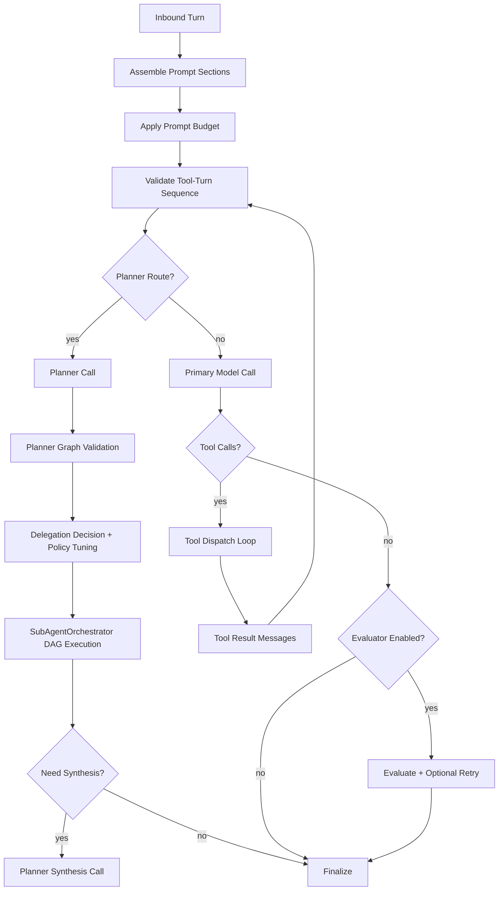

# Runtime Chat Pipeline

This document defines the runtime chat/tool pipeline implemented by `ChatExecutor`, `SubAgentOrchestrator`, and provider adapters.
It is the canonical reference for pipeline states, delegation behavior, budget controls, and fallback logic.

## Code Anchors

- `runtime/src/llm/chat-executor.ts`
- `runtime/src/llm/delegation-decision.ts`
- `runtime/src/llm/delegation-learning.ts`
- `runtime/src/gateway/subagent-orchestrator.ts`
- `runtime/src/llm/prompt-budget.ts`
- `runtime/src/llm/tool-turn-validator.ts`
- `runtime/src/llm/policy.ts`
- `runtime/src/llm/grok/adapter.ts`
- `runtime/src/gateway/daemon.ts`
- `runtime/src/eval/pipeline-quality-runner.ts`
- `runtime/src/eval/pipeline-gates.ts`
- `runtime/src/eval/decomposition-search.ts`

## End-to-End Flow

## Pipeline States and Stop Reasons

| State | Description | Primary Output |
|------|-------------|----------------|
| `assemble_prompt` | Build system/history/memory/tool/user messages | Prompt sections with section tags |
| `apply_budget` | Enforce adaptive prompt caps | Bounded messages + budget diagnostics |
| `validate_tool_turns` | Enforce assistant `tool_calls` -> `tool` result ordering | Local validation failure or continue |
| `planner_pass` | Optional bounded planner for complex turns | Planner step graph (`deterministic_tool`, `subagent_task`, `synthesis`) |
| `planner_policy` | Graph guardrails + delegation utility + optional tuned threshold | Policy decision + diagnostics |
| `planner_execute` | Deterministic tools and delegated DAG nodes | `PipelineResult` + verifier/synthesis hooks |
| `model_call` | Provider call (stateful/stateless as configured) | Assistant content/tool calls + usage |
| `tool_loop` | Execute tool calls with retries/guardrails | Tool results appended to history |
| `evaluate` | Optional response quality evaluation | Accepted response or bounded retry |
| `finalize` | Emit output + diagnostics + stop reason | `ChatExecutorResult` |

Canonical stop reasons (from `runtime/src/llm/policy.ts`):

- `completed`
- `tool_calls`
- `validation_error`
- `provider_error`
- `authentication_error`
- `rate_limited`
- `timeout`
- `tool_error`
- `budget_exceeded`
- `no_progress`
- `cancelled`

## Delegation and Planner Semantics

Planner graphs support three step types:

- `deterministic_tool`: executes through deterministic tool pipeline.
- `subagent_task`: executes through `SubAgentOrchestrator` with scoped context/tools.
- `synthesis`: final merge marker used to trigger synthesis calls when needed.

Delegation is gated by:

- planner parse/graph validation (no cycles, fanout/depth caps)
- delegated-step scope validation (`subagent_step_needs_decomposition`) so oversized child objectives are rejected before execution
- delegation utility scorer (`assessDelegationDecision`)
- hard-blocked task-class veto (`wallet_signing`, `wallet_transfer`, `stake_or_rewards`, `destructive_host_mutation`, `credential_exfiltration`)
- handoff confidence gate (`mode=handoff` requires planner confidence >= `handoffMinPlannerConfidence`)
- runtime hard caps (max depth/fanout/children/tokens/tool calls)
- optional online bandit arm tuning that offsets threshold by context cluster
- verifier rounds when enabled/forced

When planner validation or delegated execution returns `needs_decomposition`, the parent planner performs one bounded refinement pass and re-emits a smaller DAG instead of treating the signal as generic tool failure. Child sessions remain least-privilege scoped and do not automatically recurse.

For incident triage, trace logs now summarize delegated `execute_with_agent` calls with the child objective, contract, acceptance criteria, validation outcome, stop reason, and nested child tool-call summaries. Use those traced args/results rather than UI card summaries when diagnosing low-signal child behavior.

When `logging.trace.includeProviderPayloads=true`, the daemon also emits JSON `*.provider.request`, `*.provider.response`, and `*.provider.error` events for each provider call. Those events are the source of truth for exact routed tool subsets, `tool_choice`, `previous_response_id`, and raw provider `output[]` items during incident replay.

When `logging.trace.enabled=true`, the daemon emits JSON `*.executor.*` events for the internal `ChatExecutor` state machine as well. Those events are the source of truth for in-memory mutations between routing and provider dispatch: `model_call_prepared`, `contract_guidance_resolved`, `tool_rejected`, `tool_arguments_invalid`, `tool_dispatch_started`, `tool_dispatch_finished`, `route_expanded`, and `completion_gate_checked`.

When trace logging is enabled, the runtime can also fan out that same structured event stream into a bounded set of sibling operator views: `*.provider.log`, `*.executor.log`, `*.subagents.log`, and `*.errors.log`. Those files are derived from the canonical trace stream and should not drift from the primary daemon log plus observability store.

For Grok-backed research turns, provider-native `web_search` is now the preferred research path when `llm.webSearch=true`. Routed tool subsets append `web_search` for research/docs-comparison intents, delegated research scopes prefer `web_search` over browser MCP tools, and research validation accepts provider citations (`providerEvidence.citations`) as tool-grounded evidence. Keep browser MCP/Playwright tools for interactive page work such as localhost QA, DOM inspection, screenshots, clicks, and console/network validation. Provider-native search must stay model-gated: unsupported Grok models such as `grok-code-fast-1` must not advertise or inject `web_search` even when the config flag is enabled.

Terminal window open/close actions should also be routed as distinct intents. When `mcp.kitty.launch` or `mcp.kitty.close` is available, the router should prefer those direct tools and invalidate cached terminal routes on action shifts instead of reusing a stale "open terminal" cluster for "close the terminal".

Before any post-tool synthesis call (`tool_followup` on the direct path or `planner_synthesis` on the planner path), `ChatExecutor` now appends a bounded `system_runtime` execution ledger built from actual `ToolCallRecord[]` plus provider-native evidence. That ledger is authoritative: it lists executed tools, arguments, status, duration, result previews, and provider citations, and it exists specifically to ground the final answer in runtime facts rather than model self-report.

That execution ledger is intentionally phase-local. It answers "what happened in this phase," not "why did the previous phase choose this branch." If later workflows need authoritative cross-phase rationale continuity, add a separate bounded phase-transition rationale artifact rather than expanding the execution ledger into long-form narrative memory.

Planner summary fields of interest:

- `plannerSummary.delegationDecision`
- `plannerSummary.subagentVerification`
- `plannerSummary.delegationPolicyTuning`

Learning/reward proxy fields:

- `plannerSummary.delegationPolicyTuning.usefulDelegation`
- `plannerSummary.delegationPolicyTuning.usefulDelegationScore`
- `plannerSummary.delegationPolicyTuning.rewardProxyVersion`

## Budget Controls

### Prompt composition budgets

`prompt-budget.ts` enforces section-aware caps for:

- `system_anchor`
- `system_runtime`
- `memory_working`
- `memory_episodic`
- `memory_semantic`
- `history`
- `tools`
- `user`
- `assistant_runtime`

These caps are driven by:

- `llm.contextWindowTokens`
- `llm.maxTokens`
- `llm.promptSafetyMarginTokens`
- `llm.promptCharPerToken`
- `llm.promptHardMaxChars`
- `llm.maxRuntimeHints`

### Request execution budgets

`ChatExecutor` enforces:

- `llm.maxToolRounds`
- `llm.toolBudgetPerRequest`
- `llm.maxModelRecallsPerRequest` (`0` = unlimited)
- `llm.maxFailureBudgetPerRequest`
- `llm.sessionTokenBudget` (with compaction fallback)

`SubAgentOrchestrator` additionally enforces:

- `llm.subagents.maxDepth`
- `llm.subagents.maxFanoutPerTurn`
- `llm.subagents.maxTotalSubagentsPerRequest`
- `llm.subagents.maxCumulativeToolCallsPerRequestTree`
- `llm.subagents.maxCumulativeTokensPerRequestTree` (`0` = unlimited)

### Timeout layering

Timeouts are explicitly layered:

- `llm.timeoutMs` (provider request timeout + stream inactivity timeout)
- `llm.toolCallTimeoutMs` (per tool invocation)
- `llm.requestTimeoutMs` (end-to-end request timeout, `0`/unset = unlimited default)
- `llm.subagents.defaultTimeoutMs` (default child execution timeout)

## Fallback and Retry Rules

Failure taxonomy and retry policy are centralized in `llm/policy.ts` and applied in `ChatExecutor`.

| Failure class | Default retry policy | Fallback behavior |
|--------------|----------------------|-------------------|
| `validation_error` | no retry | fail fast locally; do not forward malformed tool-turns |
| `provider_error` | bounded retry | provider fallback eligible |
| `rate_limited` | bounded retry | provider fallback eligible |
| `timeout` | bounded retry | provider fallback eligible; may emit `timeout` |
| `authentication_error` | no retry | no fallback loop on deterministic auth failures |
| `tool_error` | bounded retry (idempotency-aware) | session-level tool failure breaker applies |
| `budget_exceeded` | no retry | compaction attempt, then explicit budget stop |
| `no_progress` | no retry | explicit stop with no-progress detail |

Subagent retry classes (`SubAgentOrchestrator`):

- `timeout`
- `tool_misuse`
- `malformed_result_contract`
- `needs_decomposition`
- `transient_provider_error`
- `cancelled`
- `spawn_error`
- `unknown`

Each class maps to bounded retry/backoff and a canonical stop-reason hint.

## Observability and Debugging

Per execution, runtime emits:

- per-call usage attribution (`callUsage[]`)
- prompt-shape before/after budget
- stateful diagnostics (`statefulDiagnostics`, `statefulSummary`)
- tool-routing diagnostics (`toolRoutingSummary`)
- planner diagnostics (`plannerSummary`)
- canonical `stopReason` + `stopReasonDetail`

Delegation-specific observability:

- WebChat lifecycle events: `subagents.planned|spawned|started|progress|tool.executing|tool.result|completed|failed|cancelled|synthesized`
- trace correlation: parent turn trace IDs + delegated child trace IDs
- learning signals: parent/child trajectory records and per-context arm statistics
- local observability ledger: trace events persisted to `~/.agenc/observability.sqlite` plus exact payload artifacts under `~/.agenc/trace-payloads/`
- operator portal: WebChat `TRACE` view queries `observability.summary|traces|trace|artifact|logs` to reconstruct one turn end-to-end without parsing raw daemon logs first
- foreground daemon parity: local tmux or multi-daemon foreground runs tee the same trace stream into the configured daemon log file so pane scrollback and persisted logs stay identical debugging surfaces
- tool-dispatch repair diagnostics: `*.executor.tool_dispatch_started` can include `argumentDiagnostics` when the runtime repairs or normalizes tool args immediately before execution

Operational runbooks:

- `docs/RUNTIME_PIPELINE_DEBUG_BUNDLE.md`
- `docs/INCIDENT_REPLAY_RUNBOOK.md`
- `docs/architecture/flows/subagent-orchestration.md`

## Quality Gates and Benchmarks

Pipeline reliability gates in CI:

- `npm --prefix runtime run benchmark:pipeline:ci`
- `npm --prefix runtime run benchmark:pipeline:gates`

Delegation quality gates and decomposition benchmarks:

- `npm --prefix runtime run benchmark:delegation:ci`
- `npm --prefix runtime run benchmark:delegation:gates`
- `npm --prefix runtime run benchmark:delegation`
- `npm --prefix runtime run benchmark:decomposition-search`

Gate domains include:

- context growth slope/delta
- malformed tool-turn forwarding (must remain zero)
- desktop timeout/hang regressions
- token efficiency per completed task
- delegation safety/quality/cost deltas
- pass@k and pass^k deltas vs baseline
- offline replay determinism
