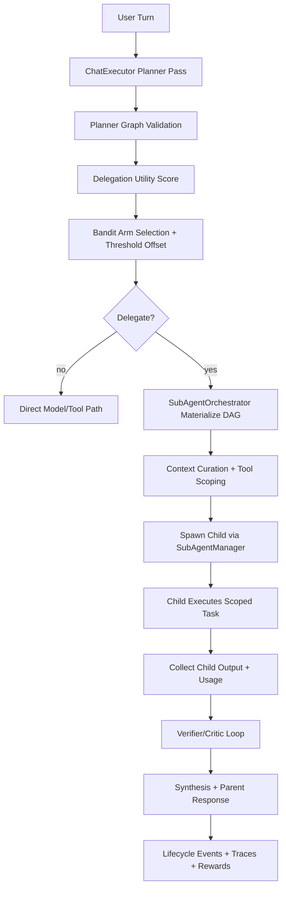

# Subagent Orchestration Flow

This document describes the canonical delegation architecture for subagent execution in AgenC runtime.
It covers message flow, policy gates, failure behavior, kill-switch controls, and observability surfaces.

## Code Anchors

- `runtime/src/llm/chat-executor.ts`
- `runtime/src/llm/delegation-decision.ts`
- `runtime/src/llm/delegation-learning.ts`
- `runtime/src/gateway/subagent-orchestrator.ts`
- `runtime/src/gateway/sub-agent.ts`
- `runtime/src/gateway/delegation-runtime.ts`
- `runtime/src/gateway/daemon.ts`
- `runtime/src/gateway/approvals.ts`

## Message Flow

### Execution Notes

- Delegated DAG nodes are executed through `SubAgentOrchestrator` under `DeterministicPipelineExecutor` contract.
- Child sessions are isolated via typed session identity and bounded lifecycle retention.
- Parent synthesis runs with child provenance and unresolved-item carryover when needed.

## Policy Gates

| Gate | Scope | Effect on Execution |
|------|-------|---------------------|
| Planner schema/graph validator | `ChatExecutor` | Rejects malformed plans, unresolved deps, cycles, cap breaches |
| Delegation utility scorer | `delegation-decision.ts` | Vetoes low-value/high-risk delegation (`shouldDelegate=false`) |
| Bandit policy tuning | `delegation-learning.ts` | Selects strategy arm per context cluster; adjusts threshold |
| Runtime delegation policy engine | `delegation-runtime.ts` | Enforces enable/allowlist/denylist/threshold checks |
| Child tool scoping | `SubAgentOrchestrator` | Applies least-privilege child allowlist strategy |
| Approval gating | `approvals.ts` | Preserves approval requirements for child tool calls |
| Request-tree budget circuit breaker | `SubAgentOrchestrator` | Stops runaway recursion/fanout/tool/tokens |
| Verifier policy | `ChatExecutor` | Requests bounded retries or blocks low-confidence child outputs |

## Failure Matrix

| Failure Class | Detected In | Retry Policy | Stop Reason Hint | Parent Fallback |
|--------------|-------------|--------------|------------------|-----------------|
| `timeout` | child spawn/exec | bounded retry | `timeout` | configurable |
| `tool_misuse` | child result/error parsing | no retry | `tool_error` | configurable |
| `malformed_result_contract` | contract validator | bounded retry | `validation_error` | configurable |
| `transient_provider_error` | child failure classifier | bounded retry | `provider_error` | configurable |
| `cancelled` | child cancellation path | no retry | `cancelled` | configurable |
| `spawn_error` | spawn exception | bounded retry | `tool_error` | configurable |
| `unknown` | residual class | no retry | `tool_error` | configurable |
| request-tree budget breach | circuit breaker | no retry | `budget_exceeded` | fail or continue without delegation |
| planner graph validation fail | planner validator | no retry | `validation_error` | falls back to direct path |

## Kill-Switch Behavior

Primary kill-switch:

- `llm.subagents.enabled=false`

Behavior when disabled:

- delegation tools are blocked by policy engine
- planner-emitted subagent tasks are vetoed
- runtime continues through non-delegated path (`fallbackBehavior` dependent)
- no daemon restart required (config reload path updates live services)

Additional safety kill controls:

- `llm.subagents.maxDepth`
- `llm.subagents.maxFanoutPerTurn`
- `llm.subagents.maxTotalSubagentsPerRequest`
- `llm.subagents.maxCumulativeToolCallsPerRequestTree`
- `llm.subagents.maxCumulativeTokensPerRequestTree` (`0` or unset = unlimited)
- `llm.subagents.spawnDecisionThreshold`
- `llm.subagents.forceVerifier`

## Observability Map

### User-visible channel events

- `subagents.planned`
- `subagents.spawned`
- `subagents.started`
- `subagents.progress`
- `subagents.tool.executing`
- `subagents.tool.result`
- `subagents.completed`
- `subagents.failed`
- `subagents.cancelled`
- `subagents.synthesized`

### Response diagnostics

- `plannerSummary.delegationDecision`
- `plannerSummary.subagentVerification`
- `plannerSummary.delegationPolicyTuning`
- `toolRoutingSummary`
- `statefulSummary`
- `stopReason` and `stopReasonDetail`

### Trace and replay surfaces

- trace logs: `webchat.inbound/chat.request/tool.call/tool.result/chat.response`
- parent-child trace linkage via correlation IDs
- incident replay and pipeline debug bundles for deterministic triage

### Learning/eval artifacts

- trajectory records (parent + child normalized tuples)
- contextual arm stats and reward distributions
- delegation benchmark artifacts (pass@k, pass^k, cost/latency/quality deltas)
- decomposition search artifacts (Pareto frontier + promoted variants)
