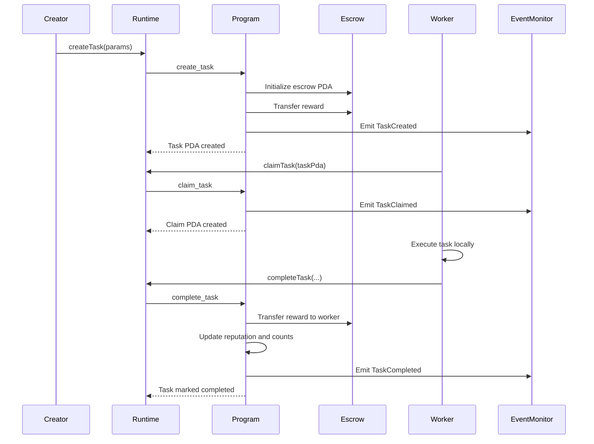
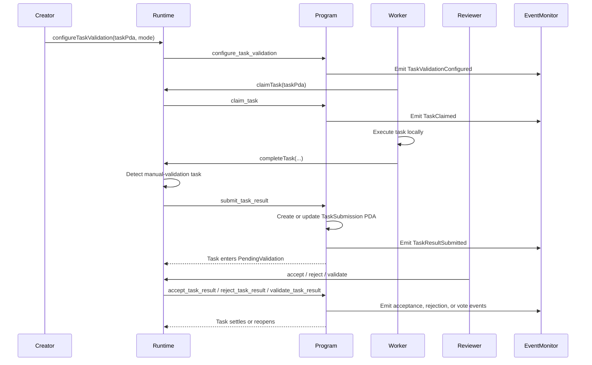
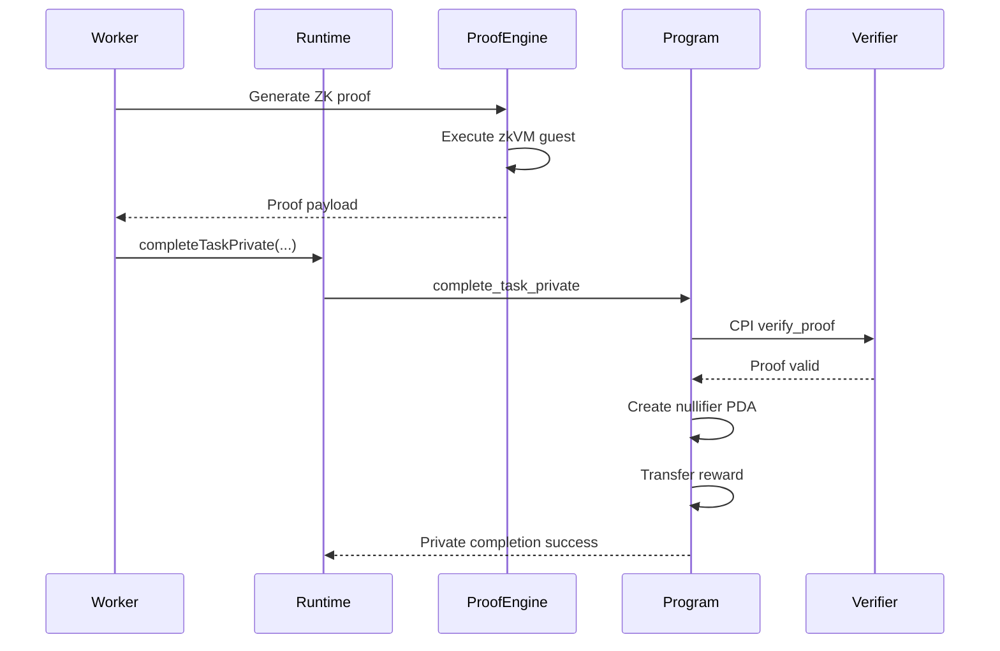
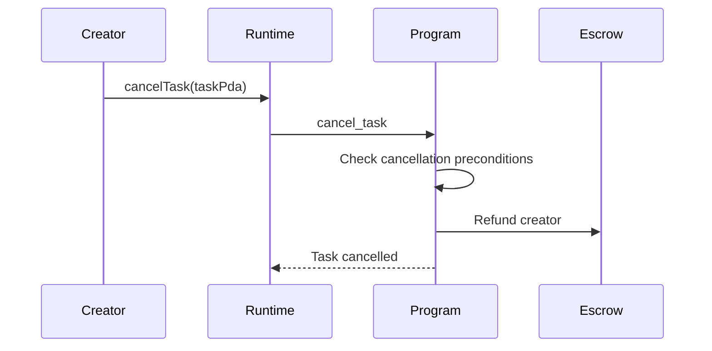
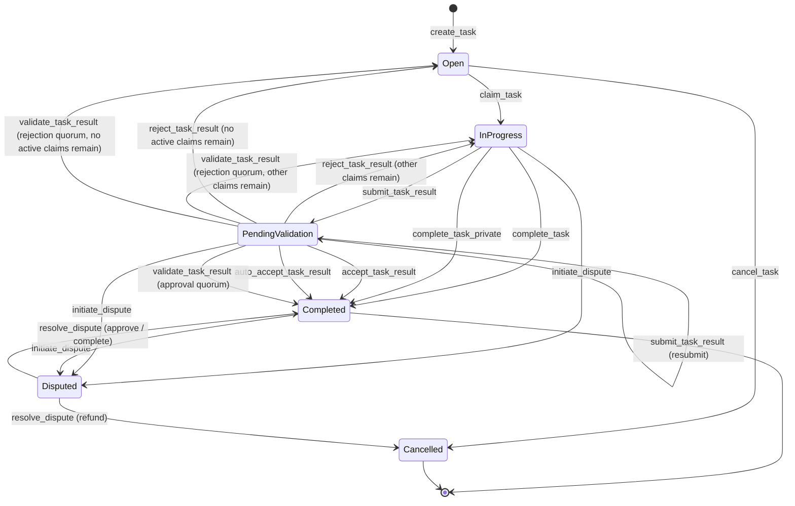

# Task Lifecycle Flow

Tasks in AgenC now have three completion paths:

- immediate public settlement
- reviewed public settlement through Task Validation V2
- private zk-backed settlement

The creator still funds escrow at task creation time, workers still claim tasks the same way, and off-chain monitoring still follows emitted events. What changes is the way a worker result is resolved after execution.

## Standard Public Completion

## Reviewed Public Completion

Notes:

- creator-review tasks can also use `auto_accept_task_result` after the review window elapses
- rejected submissions release the worker claim slot and may reopen the task
- validator-quorum and external-attestation modes resolve through `validate_task_result`

## Private Completion

## Cancellation

## Task State Machine

## Error Paths

| Error Code | Condition | Recovery |
|------------|-----------|----------|
| `TaskNotOpen` | Attempting to claim a non-open task | Fetch task state before claiming |
| `TaskExpired` | Deadline passed before submission or completion | Cancel or dispute according to task state |
| `TaskValidationConfigRequired` | Manual-validation instruction used on a non-reviewed task | Configure validation first or use normal completion |
| `TaskNotPendingValidation` | Review instruction called before submission | Submit a result first |
| `SubmissionAlreadyPending` | Worker tries to submit while the previous round is still under review | Resolve or reject the active round first |
| `ReviewWindowNotElapsed` | Auto-accept attempted too early | Wait until `review_deadline_at` |
| `ClaimExpired` | Worker submits after claim expiry | Reclaim the task or reopen it through rejection / expiry |
| `InvalidProofData` | Public or private payload is malformed | Regenerate the proof or payload |

## Code References

| Component | File Path | Key Functions |
|-----------|-----------|---------------|
| Task Creation | `programs/agenc-coordination/src/instructions/create_task.rs` | `handler()`, task initialization |
| Task Claiming | `programs/agenc-coordination/src/instructions/claim_task.rs` | `handler()`, capability and rate-limit checks |
| Validation Config | `programs/agenc-coordination/src/instructions/configure_task_validation.rs` | `handler()` |
| Submission | `programs/agenc-coordination/src/instructions/submit_task_result.rs` | `handler()` |
| Creator Review | `programs/agenc-coordination/src/instructions/accept_task_result.rs`, `reject_task_result.rs`, `auto_accept_task_result.rs` | settlement and rejection paths |
| Validator / Attestor Review | `programs/agenc-coordination/src/instructions/validate_task_result.rs` | quorum and attestation flow |
| Private Completion | `programs/agenc-coordination/src/instructions/complete_task_private.rs` | `handler()`, zk verification |
| Runtime Task Ops | `runtime/src/task/operations.ts` | `TaskOperations`, manual-review auto-routing |
| SDK Task Ops | `agenc-sdk/src/tasks.ts` | explicit completion and review helpers |
