# AgenC Architecture

High-level module map + dependency graph for the AgenC-runtime replacement
target.

The destination architecture is unambiguous:

- live session and turn ownership comes from the AgenC TypeScript port of the
  AgenC runtime
- selected AgenC loop, compaction, transport, and subagent behaviors are
  retained inside that runtime
- no permanent hybrid runtime owner remains after cutover

## Related docs

- [`invariants.md`](invariants.md) — 72 design invariants (I-1..I-72) that close design holes + edge cases from three review passes
- [`provider-matrix.md`](provider-matrix.md) — 9 providers, capability grid, auth flows
- [`behavior-inventory.md`](behavior-inventory.md) — AgenC files we port 1:1
- [`runtime-inventory.md`](runtime-inventory.md) — AgenC runtime files we hand-port (Rust→TS)
- [`feature-matrix.md`](feature-matrix.md) — every feature × source × tranche
- [`sequence-diagrams.md`](sequence-diagrams.md) — swimlane per critical path
- [`translation-conventions.md`](translation-conventions.md) — Rust→TS mapping rules

---

## Module layering

```mermaid
graph TB
  subgraph Surfaces [Phase C — Surfaces]
    CLI[bin/agenc.ts]
    TUI[tui/*]
    Commands[commands/*]
  end

  subgraph Resilience [Phase B — Resilience]
    Recovery[recovery/*]
    Transport[transport/*]
    Agents[agents/*]
  end

  subgraph Kernel [Phase A — Kernel]
    Session[session/*]
    Phases[phases/*]
    EventLog[session/event-log.ts]
    ToolRuntime[tools/streaming-executor.ts]
    Concurrency[tools/concurrency.ts]
  end

  subgraph Support [Cross-cutting]
    Prompts[prompts/*]
    Permissions[permissions/*]
    Memory[prompts/memory/*]
    Compact[llm/compact/*]
    Hooks[llm/hooks/*]
  end

  subgraph ProviderLayer [Provider abstraction — multi-provider]
    Factory[llm/provider.ts<br/>createProvider factory]
    Caps[llm/capabilities.ts<br/>static registry]
    Shape[llm/shape-request.ts<br/>capability-driven composer]
    Wire[llm/wire/*<br/>4 wire families]
    OAuth[llm/oauth/refresh-loop.ts]
    ProvGrok[providers/grok/ - default]
    ProvOpenAI[providers/openai/]
    ProvAnthropic[providers/anthropic/]
    ProvLocal[providers/ollama<br/>lmstudio]
    ProvRouted[providers/openrouter<br/>groq/deepseek/gemini]

    Factory --> Caps
    Factory --> Shape
    Shape --> Wire
    Factory --> ProvGrok
    Factory --> ProvOpenAI
    Factory --> ProvAnthropic
    Factory --> ProvLocal
    Factory --> ProvRouted
    ProvOpenAI -.-> OAuth
  end

  subgraph Locked [Verbatim — no modifications]
    Aesthetic[watch/agenc-watch-*.mjs]
    Ink[tui/ink/*]
  end

  subgraph External [External deps]
    OpenAIsdk[openai-node]
    AnthropicSDK[&#64;anthropic-ai/sdk]
    MCPsdk[&#64;modelcontextprotocol/sdk]
    React[react + react-reconciler]
  end

  CLI --> Session
  TUI --> Ink
  TUI --> Session
  TUI --> Commands
  Commands --> Session
  Commands --> Permissions

  Session --> Phases
  Session --> EventLog
  Session --> Agents

  Phases --> ToolRuntime
  Phases --> Compact
  Phases --> Prompts
  Phases --> Permissions
  Phases --> Factory
  Phases --> Recovery

  ToolRuntime --> Concurrency
  ToolRuntime --> Permissions
  ToolRuntime --> Hooks

  Recovery --> Phases

  Agents --> Session
  Agents --> Phases

  ProvGrok --> OpenAIsdk
  ProvOpenAI --> OpenAIsdk
  ProvAnthropic --> AnthropicSDK
  ProvLocal --> OpenAIsdk
  ProvRouted --> OpenAIsdk
  TUI --> React
  Session --> MCPsdk

  Prompts --> Memory

  classDef locked fill:#222,color:#fff
  class Aesthetic,Ink locked
```



---

## Source → destination map

| Source | Path | LOC | Destination |
|---|---|---|---|
| AgenC | `query.ts` | 1,838 | `runtime/src/phases/*` + `session/run-turn.ts` |
| AgenC | `services/compact/` | 4,171 | `runtime/src/llm/compact/` |
| AgenC | `services/tools/` | 3,211 | `runtime/src/tools/` |
| AgenC | `cli/transports/` | ~1,400 (subset) | `runtime/src/transport/` |
| AgenC | `ink/` | ~9,000 | `runtime/src/tui/ink/` (verbatim) |
| AgenC | `ink/components/` | ~2,300 | `runtime/src/tui/components/` |
| AgenC | `commands/` | ~2,000 (subset) | `runtime/src/commands/` |
| AgenC | `constants/prompts.ts` + `utils/agenc-md.ts` + `utils/projectInstructions.ts` | 2,471 | `runtime/src/prompts/` |
| AgenC | `memdir/` + `memoryScan.ts` + `memoryTypes.ts` | ~900 | `runtime/src/prompts/memory/` |
| AgenC | `utils/permissions/` + `hooks/toolPermission/` + `utils/sandbox/` | ~3,500 | `runtime/src/permissions/` |
| AgenC | `utils/worktree.ts` + `tools/AgentTool/*` | ~3,000 | `runtime/src/agents/{delegate,run-agent,worktree,fork-context}.ts` |
| AgenC runtime | `core/src/session/` | 3,082 (session.rs+turn.rs) | `runtime/src/session/` (hand-port) |
| AgenC | — (atop AgenC runtime `parallel.rs` RwLock primitive) | 194 | `runtime/src/tools/concurrency.ts` (AgenC-original) |
| AgenC runtime | `core/src/agent/{control,registry,role,status}.rs` | ~2,019 | `runtime/src/agents/{control,registry,role,status}.ts` (hand-port) |
| AgenC runtime | `core/src/agent/mailbox.rs` | 161 | `runtime/src/agents/mailbox.ts` (hand-port) |
| AgenC runtime | `protocol/src/protocol.rs` (event enums only) | ~500 effective | `runtime/src/session/event-log.ts` (hand-port) |
| AgenC (keep) | `runtime/src/llm/grok/` | 8,144 | — verbatim |
| AgenC (keep) | `runtime/src/watch/agenc-watch-{art,splash,ui-primitives,terminal-sequences}.mjs` | ~700 | — verbatim |

---

## Runtime boundaries

Every module lives in exactly one layer. Cross-layer calls flow only
upward in the layering diagram (Support → Kernel → Resilience →
Surfaces). No backward deps.

### Kernel invariants

1. `Session` owns all mutable state. No module outside `session/` mutates `SessionState`.
2. Every state change emits an `EventLogEntry` via `Session.emit()`. Sidecars (persistence, budget tracker, TUI indicator) subscribe to the event stream — they do not read `SessionState` directly.
3. Phases are pure: `(TurnState, ctx: TurnContext) => Promise<TurnState>`. No I/O except via injected services.
4. `TurnContext` is immutable (`readonly` fields). Constructed once per turn in `runtime/src/session/run-turn.ts:buildTurnContext()`.
5. `ToolRuntime` is the only module that calls tools. Permission evaluation happens inside, not upstream.

### Resilience invariants

1. `Recovery` is invoked only from `phases/post-sample-recovery.ts`. It never mutates `SessionState` — it returns a new `TurnState` with a `transition` marker.
2. `Transport` exposes a uniform `Transport` interface; selection is env-driven in `transport/index.ts`. No runtime probing.
3. `Agents` subagents run with isolated `Session` instances, not shared mutable state with the parent.
4. `agents/control.ts` plus child `session/*` own subagent lifecycle. `agents/delegate.ts` is an adapter over the legacy AgentTool surface, not a runtime owner.

### Surfaces invariants

1. `TUI` reads from the event stream only. No direct state mutation.
2. `Commands` dispatch through the same path as LLM-initiated tools — they go through `ToolRuntime` and `Permissions`.
3. CLI one-shot mode (`bin/agenc.ts "prompt"`) skips TUI entirely.

---

## Directory layout (final)

```
agenc-core/runtime/src/
  bin/
    agenc.ts                     # CLI entry (argv/stdin + optional TUI boot)
  session/
    session.ts                   # AgenC implementation: Session struct
    run-turn.ts                  # AgenC implementation: run_turn orchestration
    turn-context.ts              # AgenC implementation: immutable per-turn snapshot
    turn-state.ts                # AgenC implementation: 22 loop variables
    event-log.ts                 # AgenC implementation: EventLogEntry union + reducer
    rollout-item.ts              # AgenC implementation: RolloutItem JSONL wrapper
    rollout-store.ts             # AgenC-designed: JSONL append + read
    rollout-reconstruction.ts    # AgenC implementation: reverse-scan + forward-replay
    session-store.ts             # AgenC implementation: ~/.agenc/projects/<slug>/ layout
    sidecar.ts                   # AgenC-designed: async event subscribers
    file-history.ts              # AgenC implementation: per-message snapshots
  phases/
    index.ts                     # enum + transition table
    prepare-context.ts           # AgenC: phase 1 (311-652)
    stream-model.ts              # AgenC: phase 2 (685-1028)
    post-sample-recovery.ts      # AgenC: phase 3 (1093-1216)
    continuation-nudge.ts        # AgenC: phase 4 (1400-1463)
    execute-tools.ts             # AgenC: phase 5 (1471-1590)
    commit.ts                    # AgenC: phase 6 (1643-1836)
    stop-hooks.ts                # AgenC stop-gate behavior + AgenC runtime event/session wiring
  recovery/
    tombstone.ts                 # AgenC implementation
    terminal-tool-result.ts      # AgenC implementation
    fallback-ladder.ts           # AgenC implementation
    reconnection.ts              # AgenC implementation
    withhold-cascading.ts        # AgenC implementation: two-gate withhold
  tools/
    streaming-executor.ts        # AgenC implementation
    orchestration.ts             # AgenC implementation
    execution.ts                 # AgenC implementation
    hooks.ts                     # AgenC implementation (tool hooks)
    concurrency.ts               # agenc-original (atop AgenC runtime RwLock primitive)
    router.ts                    # AgenC implementation: router.rs
    orchestrator.ts              # AgenC implementation: orchestrator.rs
    context.ts                   # AgenC implementation: ToolPayload
    registry.ts                  # extend existing tool-registry.ts
  llm/
    grok/                        # historical Grok implementation retained
    ollama/                      # historical Ollama implementation retained
    providers/                   # canonical provider entrypoints
    wire/                        # provider request/response shims
    oauth/                       # shared OAuth refresh loop
    provider.ts                  # factory createProvider()
    capabilities.ts              # provider/model capability registry
    shape-request.ts             # capability-driven request composer
    types.ts                     # existing — keep
    compact/                     # AgenC implementation wholesale (15 files)
    hooks/                       # existing — keep
  transport/
    index.ts                     # Transport interface + factory
    ws-duplex.ts                 # AgenC implementation: WebSocketTransport
    ws-post.ts                   # AgenC implementation: HybridTransport
    sse-post.ts                  # AgenC implementation: SSETransport
    serial-batch-uploader.ts     # AgenC implementation: SerialBatchEventUploader
    fallback-ladder.ts           # AgenC implementation: transportUtils factory + ladder
    capability-probe.ts          # planned: per-transport feature bitmap
  agents/
    thread.ts                    # AgenC child-session wrapper over AgenC runtime control + AgenC message streaming
    worktree.ts                  # AgenC implementation: worktree.ts
    delegate.ts                  # legacy AgentTool adapter only; no child-session ownership
    run-agent.ts                 # AgenC implementation behavior invoked inside AgenC runtime-owned child session lifecycle
    fork-context.ts              # AgenC implementation: forkSubagent.ts
    mailbox.ts                   # AgenC implementation: mailbox.rs
    control.ts                   # AgenC implementation: control.rs
    registry.ts                  # AgenC implementation: registry.rs
    role.ts                      # AgenC implementation: role.rs + built-in default/explorer/awaiter
    status.ts                    # AgenC implementation: status.rs
    resume.ts                    # AgenC runtime lifecycle with retained AgenC worktree pragmatism
  permissions/
    evaluator.ts                 # AgenC implementation: hasPermissionsToUseTool
    context.ts                   # AgenC implementation: PermissionContext
    mode.ts                      # AgenC implementation: PermissionMode + cycleNextMode
    sandbox.ts                   # AgenC implementation: decision enums (no OS primitives)
    rules.ts                     # AgenC implementation: rule structures
    approval.ts                  # AgenC implementation: approval callback
    classifier.ts                # AgenC implementation: 2-stage YOLO classifier
    network-approval.ts          # AgenC implementation: network_approval.rs
  prompts/
    system-prompt.ts             # AgenC implementation: getSystemPrompt()
    project-instructions.ts      # AgenC implementation: ancestor walk + @include
    agenc-md.ts                  # AgenC 4-tier instruction file loader
    sections.ts                  # AgenC implementation: cached vs volatile sections
    memory/
      loader.ts                  # AgenC implementation: loadMemoryPrompt()
      auto-save.ts               # AgenC implementation: sessionMemory.ts
      scan.ts                    # AgenC implementation: memoryScan.ts
      types.ts                   # AgenC implementation: memoryTypes.ts
      attachments.ts             # AgenC implementation: partial attachments.ts
  commands/
    dispatcher.ts                # inline-args support (AgenC-designed)
    plan.ts                      # AgenC implementation
    permissions.ts               # AgenC implementation
    model.ts                     # AgenC implementation
    config.ts                    # AgenC implementation
    help.ts                      # AgenC implementation
    clear.ts                     # simplified
    context.ts                   # simplified
    exit.ts                      # AgenC implementation
    status.ts                    # AgenC implementation
    keybindings.ts               # simplified
  config/
    loader.ts                    # AgenC-designed: TOML loader
    schema.ts                    # merged AgenC settings + AgenC runtime profile
    profiles.ts                  # AgenC implementation: named profile overrides
    store.ts                     # snapshot + reload + subscribers (I-30/I-47)
    env.ts                       # env var resolution
    # note: the ancestor walker for AGENC.md actually lives
    # at `prompts/project-instructions.ts`; the config/ tree owns the
    # TOML surface only.
  mcp-client/                    # existing + extensions
    connection.ts                # existing
    tool-bridge.ts               # existing
    manager.ts                   # existing
    resilient-bridge.ts          # existing
    transports/
      stdio.ts                   # existing inline → extract
      sse.ts                     # NEW (AgenC runtime-mcp-inspired)
      http.ts                    # NEW (AgenC runtime-mcp-inspired)
    resource-bridge.ts           # NEW
    prompt-bridge.ts             # NEW
  tui/
    main.tsx                     # Ink entry
    App.tsx                      # root providers
    cockpit/
      Banner.tsx                 # run/status/phase/tool cockpit
      ArtPanel.tsx               # ASCII girl (wraps watch/agenc-watch-art.mjs)
      Splash.tsx                 # wraps watch/agenc-watch-splash.mjs
      StatusLineConfig.tsx       # AgenC-designed configurable status line
    transcript/
      MessageList.tsx            # ScrollBox-wrapped
      StreamingMessage.tsx       # incremental markdown
      ExecCell.tsx               # AgenC-designed exec cell model
    composer/
      Composer.tsx               # multiline + history
      Palette.tsx                # slash + file-mention
      history.ts                 # AgenC implementation
      drag-drop.ts               # AgenC implementation
      image-paste.ts             # AgenC implementation
      useComposerState.ts        # hook
    components/
      Spinner.tsx                # AgenC implementation
      Diff/                      # AgenC implementation
      HighlightedCode/           # AgenC implementation
    hooks/
      useQuery.ts                # consume run-turn events
      useMarkdownStream.ts       # AgenC implementation wrapper
      useInput.ts                # keyboard subscription
      useAnimationTick.ts        # AgenC-designed scheduler
    permissions/
      ApprovalOverlay.tsx        # AgenC-designed overlay + AgenC handler
      InteractiveHandler.tsx     # AgenC implementation
    keybindings/
      defaultBindings.ts         # AgenC implementation
    ink/                         # LOCKED — AgenC verbatim (~9,000 LOC)
    theme.ts                     # imports watch/agenc-watch-ui-primitives.mjs
  watch/                         # LOCKED — AgenC aesthetic + logic modules
    agenc-watch-art.mjs          # verbatim
    agenc-watch-splash.mjs       # verbatim
    agenc-watch-ui-primitives.mjs # verbatim
    agenc-watch-terminal-sequences.mjs # verbatim
    agenc-watch-markdown-stream.mjs   # logic module, consumed by StreamingMessage
    agenc-watch-markdown-parse.mjs    # logic module
    agenc-watch-diff-render.mjs       # logic module
    agenc-watch-render-cache.mjs      # logic module
    agenc-watch-text-utils.mjs        # logic module
  utils/
    async-lock.ts                # translation helper for Rust Mutex
    async-rwlock.ts              # translation helper for Rust RwLock
    behavior-subject.ts          # translation helper for Rust watch::channel
    async-queue.ts               # translation helper for Rust mpsc::channel
    event-emitter.ts             # translation helper
    generators.ts                # AgenC implementation: all() concurrency-capped
    error-log.ts                 # AgenC implementation: errorLogSink
```

---

## Key design decisions

### 1. Hybrid kernel: AgenC runtime discipline, AgenC implementation

The phase machine, Session type, TurnContext, and event log come from
AgenC runtime's architectural discipline. The inner phase logic (what happens
inside `stream-model`, `execute-tools`, `post-sample-recovery`) comes
from AgenC's battle-tested implementation. These are not in
conflict — AgenC runtime says "here are the types and phase boundaries,"
AgenC says "here is what runs inside."

### 2. Concurrency contract = AgenC-new enum + AgenC streaming

AgenC runtime's `RwLock` model inspired the read-vs-write discipline, but the
`ConcurrencyClass` enum itself is AgenC-original (AgenC runtime has no such
enum). AgenC's `StreamingToolExecutor` gives us mid-stream tool
dispatch + Bash-only sibling abort. Combine:

- `ConcurrencyClass.SharedRead` maps to AgenC's `isConcurrencySafe=true`
- `ConcurrencyClass.Exclusive` maps to `isConcurrencySafe=false`
- `ConcurrencyClass.SharedServer(id)` for MCP server-scoped concurrency
- `ConcurrencyClass.BackgroundTerminal` for long-running shells

### 3. Subagent = AgenC worktree + AgenC runtime mailbox

AgenC already nails worktree creation, teardown, and sparse
checkout. AgenC runtime has the better communication model (typed mailbox with
trigger-turn flag). Take both.

### 4. Event log = AgenC runtime union + AgenC sidecars

AgenC runtime's typed `EventMsg`/`RolloutItem` discriminated unions are the
format. AgenC's pattern of sidecar files (JSONL transcript +
metadata at EOF + write-queue batching) is the persistence layer. The
union lives in `session/event-log.ts`; sidecars run async subscribers
in `session/sidecar.ts`.

### 5. Ink is locked verbatim

No refactoring the reconciler. Port `AgenC/src/ink/` as a sealed
subsystem; AgenC code consumes it like a library.

### 6. Grok is the default provider, not the only one

AgenC is multi-provider. The existing Grok adapter is preserved as
the reference implementation and default (`grok-4-fast`), but
relocated to `runtime/src/llm/providers/grok/` alongside 8 sibling
adapters (OpenAI, Anthropic, Ollama, LMStudio, OpenRouter, Groq,
DeepSeek, Gemini). Capability differences resolve via the static
registry in `runtime/src/llm/capabilities.ts` and the shared request
composer `runtime/src/llm/shape-request.ts`. Full provider plan:
[`provider-matrix.md`](provider-matrix.md).

### 7. Compaction = AgenC wholesale

Delete the dead AgenC chain, copy AgenC's `services/compact/`
(15 files, 4,171 LOC). Kebab-case rename on arrival, content 1:1.

---

## Permissions Module (T11)

**Location:** `runtime/src/permissions/`

**Responsibilities:**

- **Rule loading, 5-source priority** — user, project, local, CLI,
  policy sources are merged in `permissions/settings.ts` with the
  documented precedence; the resulting `permissions/rules.ts`
  surface exposes allow/deny/ask rules to the evaluator.
- **Mode state (7 variants + cycle)** — `permissions/mode.ts` ships
  the `PermissionMode` union `default | acceptEdits | plan |
  bypassPermissions | dontAsk | auto | bubble` (7 variants, where
  `bubble` is internal-only) plus the Shift+Tab cycle via
  `getNextPermissionMode` / `cyclePermissionMode` /
  `transitionPermissionMode`, and the subscription surface
  (`PermissionModeRegistry.setMode` /
  `subscribeToModeChange`) used by I-3 guards.
- **Evaluator (5-step decision tree)** —
  `permissions/evaluator.ts` implements the ported AgenC flow:
  (1) rule/tool checks, (2) mode gate with the I-3 `getAppState()`
  re-read, (3) passthrough→ask conversion, (4) outer transforms
  (dontAsk, auto, headless fallback), (5) auto-mode classifier
  pipeline with safe-tool allowlist and denial tracking.
- **Denial tracking (3/20 limits)** —
  `permissions/denial-tracking.ts` enforces the AgenC-canonical
  limits: `maxConsecutive = 3`, `maxTotal = 20`. Exceeding either
  falls back to prompting or aborts the headless run.
- **Sandbox policy (4 variants)** — `permissions/sandbox.ts` ports
  the AgenC runtime `SandboxMode` enum (`danger_full_access`, `read_only`,
  `workspace_write`, `external_sandbox`) as a decision model only.
  No OS primitives are linked in; worktree + evaluator + cwd jail
  remain the enforcement surface.
- **Approval cache** — `permissions/approval-cache.ts` holds the
  session-scoped `Map<string, ReviewDecision>` so repeat approvals
  for the same key short-circuit the modal.
- **Network approval service** —
  `permissions/network-approval.ts` ports the host+protocol+port
  cache from AgenC runtime with `AllowOnce | AllowForSession | Deny`.
- **Bash subcommand permission check** — `permissions/bash.ts`
  ports the AgenC subcommand parser and sandbox-override
  rules; AgenC ships a ~1005 LOC lean port of the ~2598 LOC
  upstream file.

**Integration points:**

- `Session.services.permissionModeRegistry` — the single
  `PermissionModeRegistry` instance a session owns.
- `TurnContext.permissionMode` — per-turn snapshot of the active
  mode, captured at `buildTurnContext` time.
- `runToolUse` subscribe/abort — `runtime/src/tools/execution.ts`
  subscribes each in-flight tool call to mode changes and fires
  its `AbortController` on a stricter transition.
- `src/commands/` slash commands — `/permissions`, `/plan`,
  `/model`, `/provider` read and mutate through this module.

**Invariants enforced:**

- **I-3** (mid-dispatch mode re-check on every mutation tool)
- **I-30** (per-turn immutable config snapshot — consumed by the
  evaluator context)
- **I-44** (turn-id-stamped modal decisions via
  `PendingPermissionRequest.turnId`)

**Completed in T13:**

- **Classifier YOLO model** — `permissions/classifier.ts` now runs the
  2-stage pipeline with the live xAI-backed classifier path.
- **Capability registry for I-57** — `/model` and `/provider` switches
  validate history compatibility against `llm/capabilities.ts`.

## Slash Commands (T11)

**Dispatcher:** `runtime/src/commands/dispatcher.ts`

The dispatcher enforces the **I-68 parse fence** in
`parseSlashCommand`: it splits on `\n` and requires every subsequent
line to be whitespace-only before dispatching. Pasted multi-line
input that happens to start with a slash never triggers a command.

**Registry:** `runtime/src/commands/registry.ts`

`buildDefaultRegistry()` constructs the shipped registry. The
`CommandRegistry.register()` surface rejects duplicate canonical
names, rejects alias collisions with canonical names, and drops
alias-to-alias collisions with a console warning (first-registered
wins). A global registry hook lets `/help` enumerate itself without
a second cutover.

**18 shipped commands, grouped by category:**

- **Info:** `/help`, `/status`, `/keybindings`, `/diff`, `/context`
- **Memory / context:** `/init`, `/clear`, `/compact`, `/resume`,
  `/fork`
- **Mode:** `/plan`
- **Permission:** `/permissions`, `/config`
- **Lifecycle:** `/model`, `/provider`, `/exit`,
  `/enter-worktree`, `/exit-worktree`

**Bridge-safe allowlist:** `isBridgeSafeCommand` in
`commands/dispatcher.ts` exposes a closed allowlist of commands safe
to run from a remote-origin / daemon-bridged CLI front end. Unknown
commands fail closed.

## TUI Module (T12)

**Location:** `runtime/src/tui/`

T12 ships the Ink-based terminal UI that wraps the T11 runtime. The
module is laid out so the locked upstream port stays isolated from
the AgenC-authored cockpit, transcript, composer, permissions, and
keybinding code.

### Module tree

- `ink/` — **LOCKED verbatim port** (~30 files, ~9000 LOC) covering
  the Ink renderer, reconciler, node-cache, frame-diff pass,
  keypress parser, termio primitives, and focus/terminal state.
  Modifications must land with an explicit migration note in the
  commit message. Upstream bumps re-copy the subtree wholesale.
  - `ink/vendored/` — small shims (env, semver, intl, etc.) for
    imports that escape the `ink/` subtree in upstream sources.
    Kept tiny so the locked-port boundary stays clean.
- `cockpit/` — `Banner`, `ArtPanel`, `Splash`, `StatusLineConfig`.
  The framed top-of-screen AgenC chrome; separate from the locked
  Ink primitives so it can be restyled without touching the port.
- `transcript/` — `MessageList`, `StreamingMessage` (I-77 scanner),
  `ExecCell`, `SlashResultRenderer`, `PlanProgress`. Renders the
  turn stream, slash-command output, plan progress, and live
  model output.
- `composer/` — `Composer` (I-69 paste-in-flight + I-71 mention
  validator), `useComposerState`, `history`, `Palette`,
  `palette-sources`, `paste-store` (I-67 C0/C1 sanitizer),
  `image-paste` (3-platform clipboard probe), `drag-drop`.
- `permissions/` — `ApprovalOverlay` (I-21 abort-signal subscriber
  + I-72 modal keybinding-context), `InteractiveHandler` (I-44
  turn-id stamp + I-90 stale-drop + 200 ms classifier grace).
- `keybindings/` — `defaultBindings`, `KeybindingContext`,
  `loadUserBindings`. Provides `chat`/`modal`/`plan` context
  switching so I-72 can suspend composer bindings while a modal
  owns focus.
- `hooks/` — `useQuery`, `useMarkdownStream`, `useInput`,
  `useAnimationTick`. React-side observation hooks for the runtime
  query iterator and streamed markdown buffers.
- `state/` — `AppState`, `plan-state`. Central React context
  carrying session handle, config store, and plan-mode status.
- `overlay/` — `OverlayProvider`. Stack-based overlay manager;
  `InteractiveHandler` pushes `ApprovalOverlay` frames here.
- `App.tsx` — root component wired to the AgenC context tree.
- `main.tsx` — Ink bootstrap; owns the I-19 `handleStdinLoss`
  path and stdin/stdout/stderr wiring.
- `diagnostics/` — opt-in frame/input latency monitor enabled by
  `AGENC_TUI_FRAME_DEBUG`; reports slow frames, slow input, flicker,
  and periodic frame summaries without adding another render buffer.
- `theme.ts` — palette + border-style tokens shared by cockpit,
  transcript, composer, and permissions components.

### Root provider tree

The App root composes, from outside in: the six Ink contexts
(`StdinContext`, `StdoutContext`, `StderrContext`, `AppContext`,
`FocusContext`, `ErrorContext`), then AgenC-owned providers —
`AgenCAppStateProvider`, `KeybindingProvider`, `OverlayProvider` —
so downstream consumers can call `useInput`, `useKeybinding`,
`useOverlay`, and `useAppState` without threading any runtime
references through props.

### CLI branching

`runtime/src/bin/route.ts::routeCLI` is the single dispatcher the
`bin/agenc.ts` entry calls on startup. It branches between three
entrypoints based on argv and session state:

- `oneShotCLI(userMessage)` — headless one-shot; no TUI mount.
- `bootTUIEntry({...})` — full interactive TUI boot.
- `resumeTUIEntry({...})` — resume an existing session into the
  TUI (state rehydrated via `RolloutStore`).

This keeps the stdin-loss path (I-19), the SIGHUP hook (I-46), and
the TUI mount/unmount lifecycle isolated from the one-shot
provider-call path.

### Invariants enforced

- I-19 — TUI stdin loss = graceful exit (`main.tsx::handleStdinLoss`).
- I-21 — Approval modal ⊥ abort (`ApprovalOverlay`).
- I-66 — Frame-diff snapshots terminal size (`ink/ink.tsx`).
- I-67 — Paste C0/C1 sanitization (`composer/paste-store.ts`).
- I-69 — Multi-line paste atomic w.r.t. Enter (`composer/Composer.tsx`).
- I-70 — Render throttle on input idle (`ink/ink.tsx`).
- I-71 — `@mention` path-boundary validator (`composer/Composer.tsx`).
- I-72 — Modal input focus exclusive (`permissions/ApprovalOverlay.tsx`
  + `keybindings/KeybindingContext.tsx`).
- I-77 — Model output UI-spoof sanitization (`transcript/StreamingMessage.tsx`).
- I-90 — Stale pending permission dropped on turn boundary
  (`permissions/InteractiveHandler.tsx`).

### Remaining Deferred / Product Follow-Ups

The following surfaces are intentionally outside the completed T13 runtime
provider tranche and should land as explicit follow-up work:

- Shell config install/update wiring on top of the live alias
  auto-detect utility.
- Auto-updater for the installed `@tetsuo-ai/agenc` wrapper.
- Full plugin marketplace/watcher refresh beyond the live local
  skills/plugin filesystem loader.
- Voice input, vim mode, multi-pane.
