# AgenC Architecture

High-level module map + dependency graph for the hybrid build.

## Related docs

- [`invariants.md`](invariants.md) — 72 design invariants (I-1..I-72) that close design holes + edge cases from three review passes
- [`provider-matrix.md`](provider-matrix.md) — 9 providers, capability grid, auth flows
- [`openclaude-inventory.md`](openclaude-inventory.md) — openclaude files we port 1:1
- [`codex-inventory.md`](codex-inventory.md) — codex files we hand-port (Rust→TS)
- [`feature-matrix.md`](feature-matrix.md) — every feature × source × tranche
- [`sequence-diagrams.md`](sequence-diagrams.md) — swimlane per critical path
- [`translation-conventions.md`](translation-conventions.md) — Rust→TS mapping rules

---

## Module layering

```mermaid
graph TB
  subgraph Surfaces [Phase C — Surfaces]
    CLI[bin/agenc.ts]
    TUI[tui/*]
    Commands[commands/*]
  end

  subgraph Resilience [Phase B — Resilience]
    Recovery[recovery/*]
    Transport[transport/*]
    Agents[agents/*]
  end

  subgraph Kernel [Phase A — Kernel]
    Session[session/*]
    Phases[phases/*]
    EventLog[session/event-log.ts]
    ToolRuntime[tools/streaming-executor.ts]
    Concurrency[tools/concurrency.ts]
  end

  subgraph Support [Cross-cutting]
    Prompts[prompts/*]
    Permissions[permissions/*]
    Memory[prompts/memory/*]
    Compact[llm/compact/*]
    Hooks[llm/hooks/*]
  end

  subgraph ProviderLayer [Provider abstraction — multi-provider]
    Factory[llm/provider.ts<br/>createProvider factory]
    Caps[llm/capabilities.ts<br/>static registry]
    Shape[llm/shape-request.ts<br/>capability-driven composer]
    Wire[llm/wire/*<br/>4 wire families]
    OAuth[llm/oauth/refresh-loop.ts]
    ProvGrok[providers/grok/ - default]
    ProvOpenAI[providers/openai/]
    ProvAnthropic[providers/anthropic/]
    ProvLocal[providers/ollama<br/>lmstudio]
    ProvRouted[providers/openrouter<br/>groq/deepseek/gemini]

    Factory --> Caps
    Factory --> Shape
    Shape --> Wire
    Factory --> ProvGrok
    Factory --> ProvOpenAI
    Factory --> ProvAnthropic
    Factory --> ProvLocal
    Factory --> ProvRouted
    ProvOpenAI -.-> OAuth
  end

  subgraph Locked [Verbatim — no modifications]
    Aesthetic[watch/agenc-watch-*.mjs]
    Ink[tui/ink/*]
  end

  subgraph External [External deps]
    OpenAIsdk[openai-node]
    AnthropicSDK[&#64;anthropic-ai/sdk]
    MCPsdk[&#64;modelcontextprotocol/sdk]
    React[react + react-reconciler]
  end

  CLI --> Session
  TUI --> Ink
  TUI --> Session
  TUI --> Commands
  Commands --> Session
  Commands --> Permissions

  Session --> Phases
  Session --> EventLog
  Session --> Agents

  Phases --> ToolRuntime
  Phases --> Compact
  Phases --> Prompts
  Phases --> Permissions
  Phases --> Factory
  Phases --> Recovery

  ToolRuntime --> Concurrency
  ToolRuntime --> Permissions
  ToolRuntime --> Hooks

  Recovery --> Phases

  Agents --> Session
  Agents --> Phases

  ProvGrok --> OpenAIsdk
  ProvOpenAI --> OpenAIsdk
  ProvAnthropic --> AnthropicSDK
  ProvLocal --> OpenAIsdk
  ProvRouted --> OpenAIsdk
  TUI --> React
  Session --> MCPsdk

  Prompts --> Memory

  classDef locked fill:#222,color:#fff
  class Aesthetic,Ink locked
```



---

## Source → destination map

| Source | Path | LOC | Destination |
|---|---|---|---|
| Openclaude | `query.ts` | 1,838 | `runtime/src/phases/*` + `session/run-turn.ts` |
| Openclaude | `services/compact/` | 4,171 | `runtime/src/llm/compact/` |
| Openclaude | `services/tools/` | 3,211 | `runtime/src/tools/` |
| Openclaude | `cli/transports/` | ~1,400 (subset) | `runtime/src/transport/` |
| Openclaude | `ink/` | ~9,000 | `runtime/src/tui/ink/` (verbatim) |
| Openclaude | `ink/components/` | ~2,300 | `runtime/src/tui/components/` |
| Openclaude | `commands/` | ~2,000 (subset) | `runtime/src/commands/` |
| Openclaude | `constants/prompts.ts` + `utils/claudemd.ts` + `utils/projectInstructions.ts` | 2,471 | `runtime/src/prompts/` |
| Openclaude | `memdir/` + `memoryScan.ts` + `memoryTypes.ts` | ~900 | `runtime/src/prompts/memory/` |
| Openclaude | `utils/permissions/` + `hooks/toolPermission/` + `utils/sandbox/` | ~3,500 | `runtime/src/permissions/` |
| Openclaude | `utils/worktree.ts` + `tools/AgentTool/*` | ~3,000 | `runtime/src/agents/` |
| Codex | `core/src/session/` | 3,082 (session.rs+turn.rs) | `runtime/src/session/` (hand-port) |
| Codex | `core/src/tools/parallel.rs` | 194 | `runtime/src/tools/concurrency.ts` (hand-port) |
| Codex | `core/src/agent/mailbox.rs` | 161 | `runtime/src/agents/mailbox.ts` (hand-port) |
| Codex | `protocol/src/protocol.rs` (event enums only) | ~500 effective | `runtime/src/session/event-log.ts` (hand-port) |
| AgenC (keep) | `runtime/src/llm/grok/` | 8,144 | — verbatim |
| AgenC (keep) | `runtime/src/watch/agenc-watch-{art,splash,ui-primitives,terminal-sequences}.mjs` | ~700 | — verbatim |

---

## Runtime boundaries

Every module lives in exactly one layer. Cross-layer calls flow only
upward in the layering diagram (Support → Kernel → Resilience →
Surfaces). No backward deps.

### Kernel invariants

1. `Session` owns all mutable state. No module outside `session/` mutates `SessionState`.
2. Every state change emits an `EventLogEntry` via `Session.emit()`. Sidecars (persistence, budget tracker, TUI indicator) subscribe to the event stream — they do not read `SessionState` directly.
3. Phases are pure: `(TurnState, ctx: TurnContext) => Promise<TurnState>`. No I/O except via injected services.
4. `TurnContext` is immutable (`readonly` fields). Constructed once per turn in `runtime/src/session/run-turn.ts:buildTurnContext()`.
5. `ToolRuntime` is the only module that calls tools. Permission evaluation happens inside, not upstream.

### Resilience invariants

1. `Recovery` is invoked only from `phases/post-sample-recovery.ts`. It never mutates `SessionState` — it returns a new `TurnState` with a `transition` marker.
2. `Transport` exposes a uniform `Transport` interface; selection is env-driven in `transport/index.ts`. No runtime probing.
3. `Agents` subagents run with isolated `Session` instances, not shared mutable state with the parent.

### Surfaces invariants

1. `TUI` reads from the event stream only. No direct state mutation.
2. `Commands` dispatch through the same path as LLM-initiated tools — they go through `ToolRuntime` and `Permissions`.
3. CLI one-shot mode (`bin/agenc.ts "prompt"`) skips TUI entirely.

---

## Directory layout (final)

```
agenc-core/runtime/src/
  bin/
    agenc.ts                     # CLI entry (argv/stdin + optional TUI boot)
  session/
    session.ts                   # codex-port: Session struct
    run-turn.ts                  # codex-port: run_turn orchestration
    turn-context.ts              # codex-port: immutable per-turn snapshot
    turn-state.ts                # openclaude-port: 22 loop variables
    event-log.ts                 # codex-port: EventLogEntry union + reducer
    rollout-item.ts              # codex-port: RolloutItem JSONL wrapper
    rollout-store.ts             # codex-inspired: JSONL append + read
    rollout-reconstruction.ts    # codex-port: reverse-scan + forward-replay
    session-store.ts             # openclaude-port: ~/.agenc/projects/<slug>/ layout
    sidecar.ts                   # openclaude-inspired: async event subscribers
    file-history.ts              # openclaude-port: per-message snapshots
  phases/
    index.ts                     # enum + transition table
    prepare-context.ts           # openclaude: phase 1 (311-652)
    stream-model.ts              # openclaude: phase 2 (685-1028)
    post-sample-recovery.ts      # openclaude: phase 3 (1093-1216)
    continuation-nudge.ts        # openclaude: phase 4 (1400-1463)
    execute-tools.ts             # openclaude: phase 5 (1471-1590)
    commit.ts                    # openclaude: phase 6 (1643-1836)
    stop-hooks.ts                # hybrid: openclaude stop-gate + codex stop hook events
  recovery/
    tombstone.ts                 # openclaude-port
    terminal-tool-result.ts      # openclaude-port
    fallback-ladder.ts           # openclaude-port
    reconnection.ts              # openclaude-port
    withhold-cascading.ts        # openclaude-port: two-gate withhold
  tools/
    streaming-executor.ts        # openclaude-port
    orchestration.ts             # openclaude-port
    execution.ts                 # openclaude-port
    hooks.ts                     # openclaude-port (tool hooks)
    concurrency.ts               # codex-port: parallel.rs
    router.ts                    # codex-port: router.rs
    orchestrator.ts              # codex-port: orchestrator.rs
    context.ts                   # codex-port: ToolPayload
    registry.ts                  # extend existing tool-registry.ts
  llm/
    grok/                        # LOCKED — verbatim
    openai.ts                    # stub for future adapter
    anthropic.ts                 # stub for future adapter
    provider.ts                  # factory createProvider()
    types.ts                     # existing — keep
    compact/                     # openclaude-port wholesale (15 files)
    hooks/                       # existing — keep
  transport/
    index.ts                     # Transport interface + factory
    ws-duplex.ts                 # openclaude-port: WebSocketTransport
    ws-post.ts                   # openclaude-port: HybridTransport
    sse-post.ts                  # openclaude-port: SSETransport
    serial-batch-uploader.ts     # openclaude-port: SerialBatchEventUploader
    fallback-ladder.ts           # openclaude-port: transportUtils factory + ladder
    capability-probe.ts          # planned: per-transport feature bitmap
  agents/
    thread.ts                    # openclaude+codex hybrid: AgentThread
    worktree.ts                  # openclaude-port: worktree.ts
    delegate.ts                  # openclaude-port: AgentTool.tsx spawn logic
    fork-context.ts              # openclaude-port: forkSubagent.ts
    mailbox.ts                   # codex-port: mailbox.rs
    control.ts                   # codex-port: control.rs
    registry.ts                  # codex-port: registry.rs
    role.ts                      # codex-port: role.rs + built-in default/explorer/awaiter
    status.ts                    # codex-port: status.rs
    resume.ts                    # openclaude+codex: resume vs restart pragmatism
  permissions/
    evaluator.ts                 # openclaude-port: hasPermissionsToUseTool
    context.ts                   # openclaude-port: PermissionContext
    mode.ts                      # openclaude-port: PermissionMode + cycleNextMode
    sandbox.ts                   # codex-port: decision enums (no OS primitives)
    rules.ts                     # openclaude-port: rule structures
    approval.ts                  # openclaude-port: approval callback
    classifier.ts                # openclaude-port: 2-stage YOLO classifier
    network-approval.ts          # codex-port: network_approval.rs
  prompts/
    system-prompt.ts             # openclaude-port: getSystemPrompt()
    project-instructions.ts      # openclaude-port: ancestor walk + @include
    claude-md.ts                 # openclaude-port: 4-tier memory file loader
    sections.ts                  # openclaude-port: cached vs volatile sections
    memory/
      loader.ts                  # openclaude-port: loadMemoryPrompt()
      auto-save.ts               # openclaude-port: sessionMemory.ts
      scan.ts                    # openclaude-port: memoryScan.ts
      types.ts                   # openclaude-port: memoryTypes.ts
      attachments.ts             # openclaude-port: partial attachments.ts
  commands/
    dispatcher.ts                # inline-args support (codex-inspired)
    plan.ts                      # openclaude-port
    permissions.ts               # openclaude-port
    model.ts                     # openclaude-port
    config.ts                    # openclaude-port
    help.ts                      # openclaude-port
    clear.ts                     # simplified
    context.ts                   # simplified
    exit.ts                      # openclaude-port
    status.ts                    # openclaude-port
    keybindings.ts               # simplified
  config/
    loader.ts                    # codex-inspired: TOML loader
    schema.ts                    # merged openclaude settings + codex profile
    profiles.ts                  # codex-port: named profile overrides
    store.ts                     # snapshot + reload + subscribers (I-30/I-47)
    env.ts                       # env var resolution
    # note: the ancestor walker for AGENTS.md/CLAUDE.md actually lives
    # at `prompts/project-instructions.ts`; the config/ tree owns the
    # TOML surface only.
  mcp-client/                    # existing + extensions
    connection.ts                # existing
    tool-bridge.ts               # existing
    manager.ts                   # existing
    resilient-bridge.ts          # existing
    transports/
      stdio.ts                   # existing inline → extract
      sse.ts                     # NEW (codex-mcp-inspired)
      http.ts                    # NEW (codex-mcp-inspired)
    resource-bridge.ts           # NEW
    prompt-bridge.ts             # NEW
  tui/
    main.tsx                     # Ink entry
    App.tsx                      # root providers
    cockpit/
      Banner.tsx                 # run/status/phase/tool cockpit
      ArtPanel.tsx               # ASCII girl (wraps watch/agenc-watch-art.mjs)
      Splash.tsx                 # wraps watch/agenc-watch-splash.mjs
      StatusLineConfig.tsx       # codex-inspired configurable status line
    transcript/
      MessageList.tsx            # ScrollBox-wrapped
      StreamingMessage.tsx       # incremental markdown
      ExecCell.tsx               # codex-inspired exec cell model
    composer/
      Composer.tsx               # multiline + history
      Palette.tsx                # slash + file-mention
      history.ts                 # openclaude-port
      drag-drop.ts               # openclaude-port
      image-paste.ts             # openclaude-port
      useComposerState.ts        # hook
    components/
      Spinner.tsx                # openclaude-port
      Diff/                      # openclaude-port
      HighlightedCode/           # openclaude-port
    hooks/
      useQuery.ts                # consume run-turn events
      useMarkdownStream.ts       # openclaude-port wrapper
      useInput.ts                # keyboard subscription
      useAnimationTick.ts        # codex-inspired scheduler
    permissions/
      ApprovalOverlay.tsx        # codex-inspired overlay + openclaude handler
      InteractiveHandler.tsx     # openclaude-port
    keybindings/
      defaultBindings.ts         # openclaude-port
    ink/                         # LOCKED — openclaude verbatim (~9,000 LOC)
    theme.ts                     # imports watch/agenc-watch-ui-primitives.mjs
  watch/                         # LOCKED — AgenC aesthetic + logic modules
    agenc-watch-art.mjs          # verbatim
    agenc-watch-splash.mjs       # verbatim
    agenc-watch-ui-primitives.mjs # verbatim
    agenc-watch-terminal-sequences.mjs # verbatim
    agenc-watch-markdown-stream.mjs   # logic module, consumed by StreamingMessage
    agenc-watch-markdown-parse.mjs    # logic module
    agenc-watch-diff-render.mjs       # logic module
    agenc-watch-render-cache.mjs      # logic module
    agenc-watch-text-utils.mjs        # logic module
  utils/
    async-lock.ts                # translation helper for Rust Mutex
    async-rwlock.ts              # translation helper for Rust RwLock
    behavior-subject.ts          # translation helper for Rust watch::channel
    async-queue.ts               # translation helper for Rust mpsc::channel
    event-emitter.ts             # translation helper
    generators.ts                # openclaude-port: all() concurrency-capped
    error-log.ts                 # openclaude-port: errorLogSink
```

---

## Key design decisions

### 1. Hybrid kernel: codex discipline, openclaude implementation

The phase machine, Session type, TurnContext, and event log come from
codex's architectural discipline. The inner phase logic (what happens
inside `stream-model`, `execute-tools`, `post-sample-recovery`) comes
from openclaude's battle-tested implementation. These are not in
conflict — codex says "here are the types and phase boundaries,"
openclaude says "here is what runs inside."

### 2. Concurrency contract = codex enum + openclaude streaming

Codex's `RwLock` model gives us the read-vs-write discipline. Openclaude's
`StreamingToolExecutor` gives us mid-stream tool dispatch + Bash-only
sibling abort. Combine:

- `ConcurrencyClass.SharedRead` maps to openclaude's `isConcurrencySafe=true`
- `ConcurrencyClass.Exclusive` maps to `isConcurrencySafe=false`
- `ConcurrencyClass.SharedServer(id)` for MCP server-scoped concurrency
- `ConcurrencyClass.BackgroundTerminal` for long-running shells

### 3. Subagent = openclaude worktree + codex mailbox

Openclaude already nails worktree creation, teardown, and sparse
checkout. Codex has the better communication model (typed mailbox with
trigger-turn flag). Take both.

### 4. Event log = codex union + openclaude sidecars

Codex's typed `EventMsg`/`RolloutItem` discriminated unions are the
format. Openclaude's pattern of sidecar files (JSONL transcript +
metadata at EOF + write-queue batching) is the persistence layer. The
union lives in `session/event-log.ts`; sidecars run async subscribers
in `session/sidecar.ts`.

### 5. Ink is locked verbatim

No refactoring the reconciler. Port `openclaude/src/ink/` as a sealed
subsystem; AgenC code consumes it like a library.

### 6. Grok is the default provider, not the only one

AgenC is multi-provider. The existing Grok adapter is preserved as
the reference implementation and default (`grok-4-fast`), but
relocated to `runtime/src/llm/providers/grok/` alongside 8 sibling
adapters (OpenAI, Anthropic, Ollama, LMStudio, OpenRouter, Groq,
DeepSeek, Gemini). Capability differences resolve via the static
registry in `runtime/src/llm/capabilities.ts` and the shared request
composer `runtime/src/llm/shape-request.ts`. Full provider plan:
[`provider-matrix.md`](provider-matrix.md).

### 7. Compaction = openclaude wholesale

Delete the dead AgenC chain, copy openclaude's `services/compact/`
(15 files, 4,171 LOC). Kebab-case rename on arrival, content 1:1.
