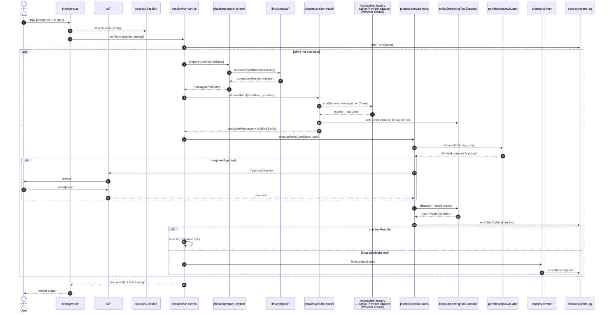
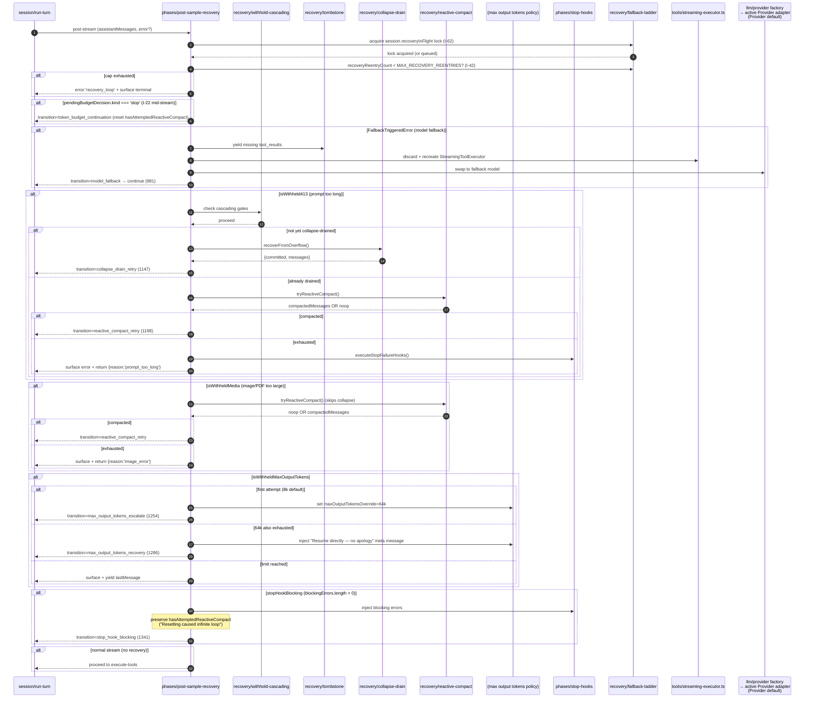
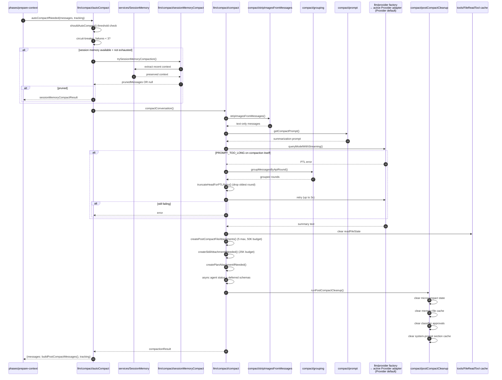
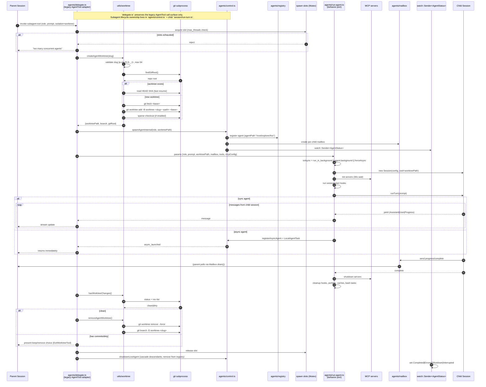
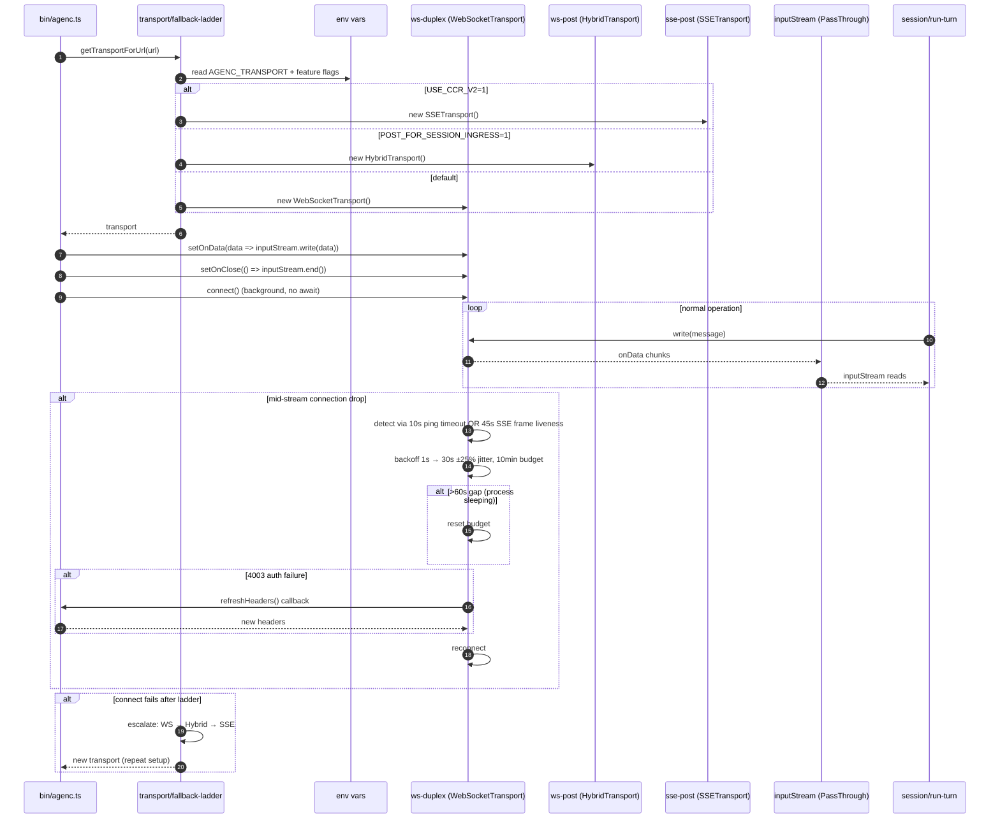
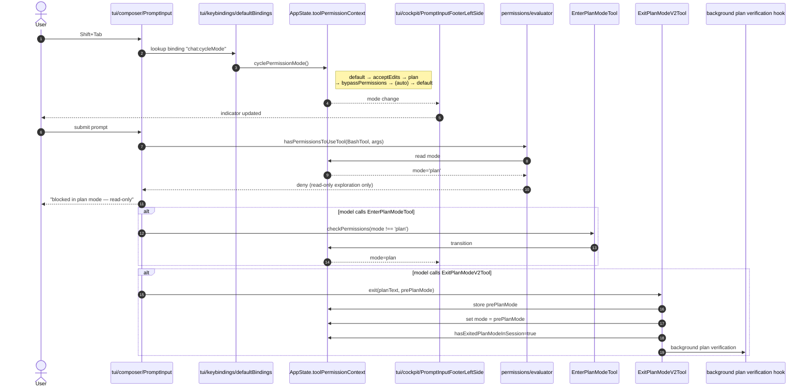
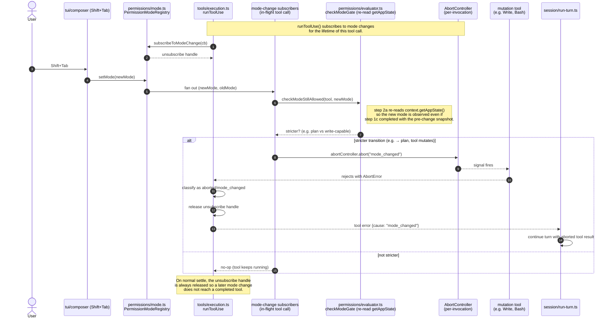
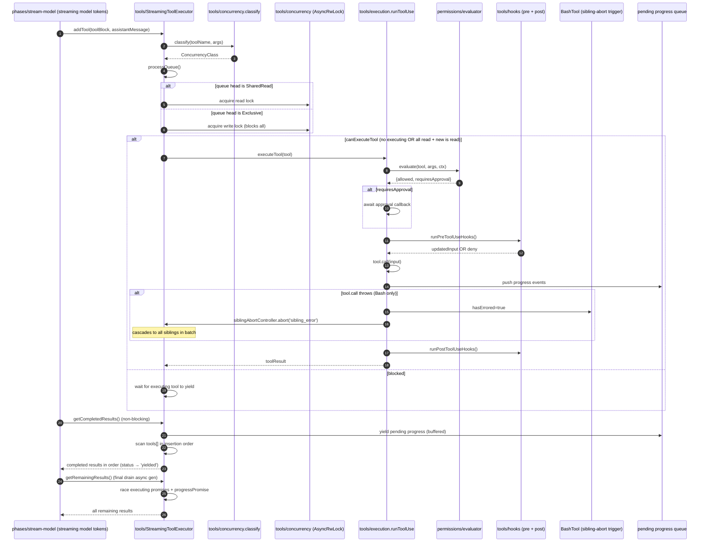
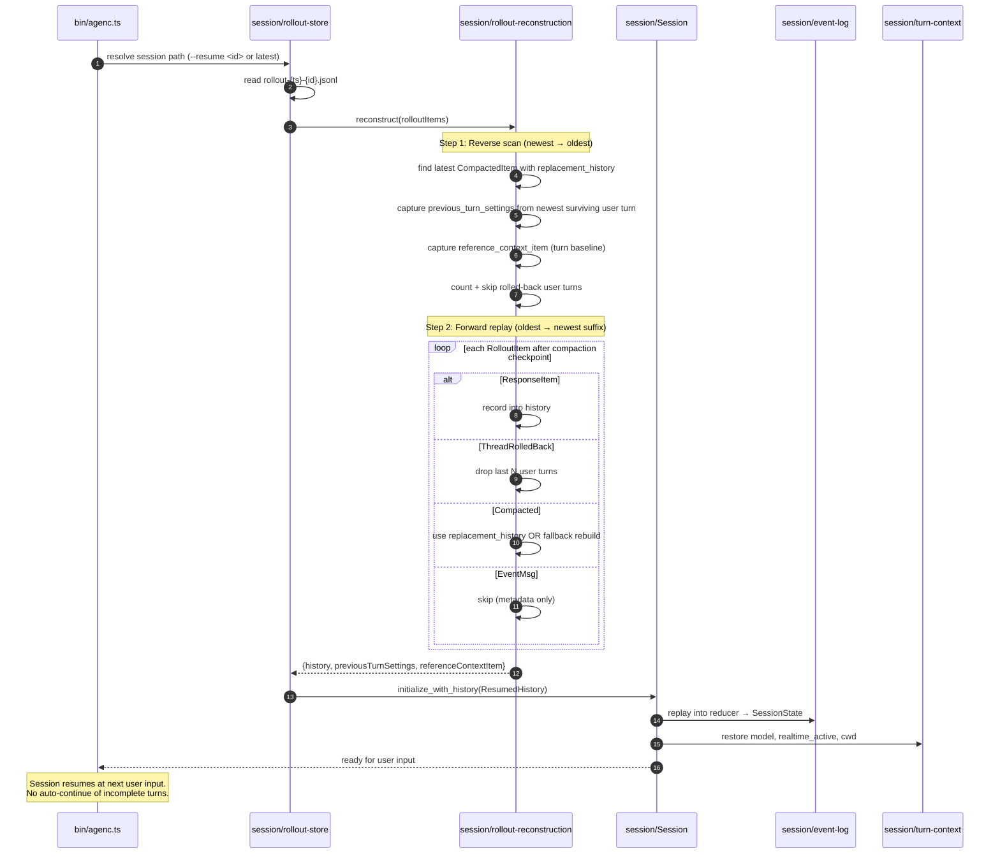
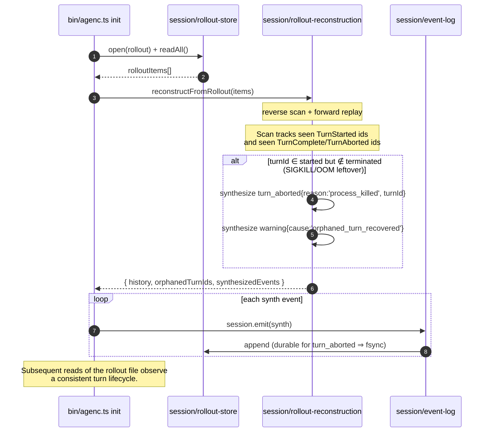

# Sequence Diagrams

Mermaid swimlane diagrams for every critical data path.

---

## 1. Turn lifecycle (happy path)



---

## 2. Post-sample recovery ladder



**Critical invariants encoded here:**

1. **Two-gate withhold**: `isWithheld413` AND `!transition.reason=collapse_drain_retry` both required before escalating to reactive compact.
2. **`hasAttemptedReactiveCompact` asymmetry**: reset on token-budget continuation (1369) but **preserved** on stop hook blocking (1332).
3. **API-error stop-hook guard**: `executeStopFailureHooks` only fires when `lastMessage?.isApiErrorMessage` — without this, tokens spiral.
4. **Executor ring flush**: both streaming fallback AND model fallback call `tools.discard()` + recreate. Missing either path leaks orphan `tool_use_id`s.

---

## 3. Compaction pipeline



---

## 4. Subagent spawn (worktree isolation)



---

## 5. Transport ladder + reconnection



---

## 6. /plan mode + Shift+Tab cycle



### 6a. Mid-execution permission mode change (T11 I-3)

This swimlane traces what happens when the user presses Shift+Tab
while a mutation tool is mid-flight. The I-3 guarantee is that a
stricter mode (e.g. transition into `plan`) must abort the in-flight
write before it commits, and the turn must propagate that abort as a
normal tool error rather than a silent success.



**Critical invariants encoded here:**

1. **Re-read at step 2a (I-3)**: the evaluator's `checkModeGate`
   calls `context.getAppState()` fresh at mode-check time rather
   than reusing the snapshot captured in step 1. This closes the
   Shift+Tab-after-rule-check race.
2. **Unsubscribe on settle**: `runToolUse` releases the mode-change
   subscription whether the tool completed, errored, timed out, or
   was aborted. A later mode change must never reach a finished
   tool call.
3. **Abort propagates as tool error**: the signal fires from the
   subscriber callback; the tool's own abort plumbing surfaces the
   rejection; `tools/execution.ts` classifies it and the turn
   continues with a proper tool error rather than a partial
   commit.

---

## 7. Tool execution with concurrency class



---

## 8. Session resume (rollout reconstruction)



### 8a. Session resume — orphan TurnStarted recovery (I-48)



---

## 9. Approval overlay lifecycle (T12 I-21 / I-44 / I-72 / I-90 + 200 ms grace)

```mermaid
sequenceDiagram
  autonumber
  actor User
  participant Evaluator as permissions/evaluator
  participant Queue as permissions/PermissionQueueOps
  participant Handler as tui/permissions/InteractiveHandler
  participant Classifier as permissions/classifier
  participant Modal as tui/permissions/ApprovalOverlay
  participant Keys as tui/keybindings/KeybindingContext
  participant Abort as session.abortController
  participant Session as session/Session

  Evaluator->>Evaluator: resolve behavior = 'ask' for tool call
  Evaluator->>Session: read activeTurn.turnId (I-44 stamp)
  Evaluator->>Queue: enqueue(PendingPermissionRequest{turnId, resolveOnce})
  Queue-->>Handler: App's Overlay consumer mounts InteractiveHandler

  Handler->>Session: activeTurn.unsafePeek().turnId
  alt request.turnId !== active turnId (I-44 / I-90)
    Handler->>Session: emit warning:stale_pending_dropped
    Handler->>Evaluator: resolveOnce.claim({behavior:'deny', source:'stale_pending_dropped'})
    Note over Handler: Unmount silently; modal never rendered
  else turn-ids match
    Handler->>Classifier: classifyYoloAction(request, signal)
    Note over Handler,Classifier: Race against 200 ms grace timer
    alt classifier returns {shouldBlock:false, unavailable:false} inside 200 ms
      Handler->>Session: emit warning:classifier_auto_approved
      Handler->>Evaluator: resolveOnce.claim({behavior:'allow', source:'classifier_auto_approved'})
      Note over Handler: Auto-approve; skip modal
    else timeout / unavailable / error / block
      Handler->>Modal: push(ApprovalOverlay)
      Modal->>Abort: subscribe to signal (I-21)
      Modal->>Keys: setActiveContext('modal') (I-72)
      Note over Modal,Keys: Composer bindings suspended
      alt user decision
        User->>Modal: Y / A / D / Esc
        Modal->>Handler: onResolve(decision)
        Handler->>Evaluator: resolveOnce.claim({behavior, source:'user'})
      else abort signal fires (Ctrl+C, shutdown) (I-21)
        Abort-->>Modal: abort event
        Modal->>Handler: onResolve({behavior:'abort'})
        Handler->>Evaluator: resolveOnce.claim({behavior:'abort'})
      end
      Modal->>Abort: unsubscribe
      Modal->>Keys: restore 'chat' context (I-72)
      Handler->>Modal: dispose overlay
    end
  end
```

Notes:

1. The I-44 stamp at step 2 and the I-90 stale-drop at step 4 are
   the same mechanism: the evaluator records `turnId` on the
   request; the handler compares it against `session.activeTurn`
   at mount. A turn switch (provider change via I-13, new prompt,
   recovery re-entry) between enqueue and mount trips the drop.
2. The 200 ms grace race runs **before** the modal mounts. T13 wires the
   live xAI-backed classifier path, so safe auto-approve decisions can now
   win the grace race before the modal appears.
3. Step 9's `setActiveContext('modal')` is the I-72 handoff: the
   underlying `Composer` stays mounted but stops consuming
   keystrokes until step 17 restores the `chat` context.
4. If the handler unmounts with an unresolved request (operator
   closes the UI abruptly), the unmount effect claims
   `{behavior:'abort', source:'component_unmounted'}` so the
   evaluator's awaiter cannot deadlock.
